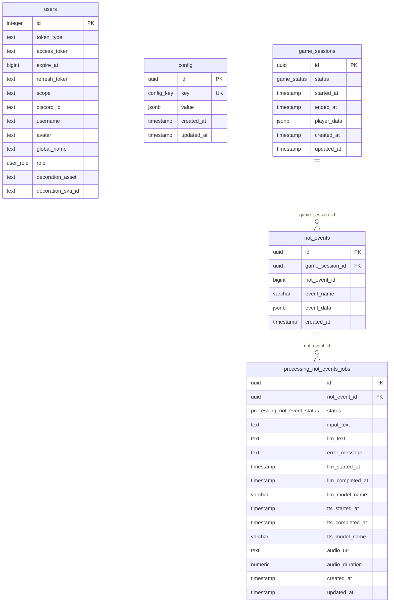

# Database Schema

> Auto-generated on each push – do not edit manually.

**Last updated:** 2026-03-24T18:55:38.421Z

```mermaid
erDiagram
    users {
        integer id PK
        text token_type
        text access_token
        bigint expire_at
        text refresh_token
        text scope
        text discord_id
        text username
        text avatar
        text global_name
        user_role role
        text decoration_asset
        text decoration_sku_id
    }
    config {
        uuid id PK
        config_key key UK
        jsonb value
        timestamp created_at
        timestamp updated_at
    }
    game_sessions {
        uuid id PK
        game_status status
        timestamp started_at
        timestamp ended_at
        jsonb player_data
        timestamp created_at
        timestamp updated_at
    }
    riot_events {
        uuid id PK
        uuid game_session_id FK
        bigint riot_event_id
        varchar event_name
        jsonb event_data
        timestamp created_at
    }
    processing_riot_events_jobs {
        uuid id PK
        uuid riot_event_id FK
        processing_riot_event_status status
        text input_text
        text llm_text
        text error_message
        timestamp llm_started_at
        timestamp llm_completed_at
        varchar llm_model_name
        timestamp tts_started_at
        timestamp tts_completed_at
        varchar tts_model_name
        text audio_url
        numeric audio_duration
        timestamp created_at
        timestamp updated_at
    }
    game_sessions ||--o{ riot_events : "game_session_id"
    riot_events ||--o{ processing_riot_events_jobs : "riot_event_id"
```
